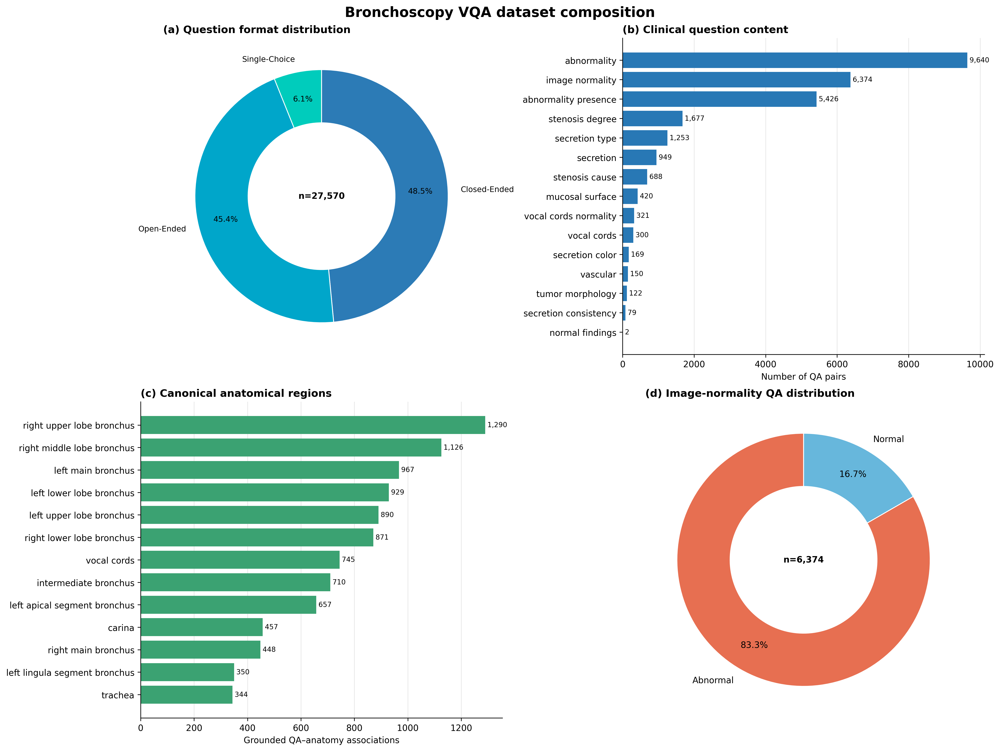
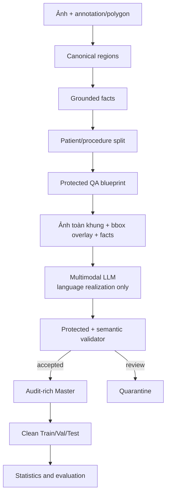
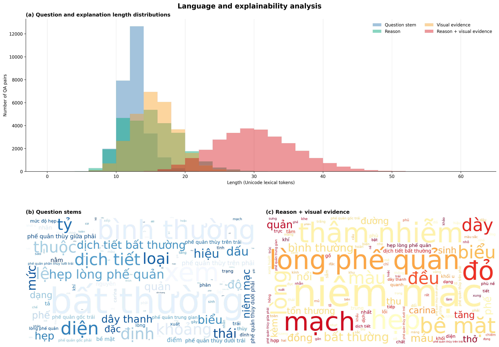

# Bronchoscopy-VQA v4.3

**Fact-grounded, visually grounded and auditable Vietnamese VQA for bronchoscopy images**

Bronchoscopy-VQA v4.3 là một nghiên cứu xây dựng dữ liệu Visual Question Answering (VQA) tiếng Việt cho ảnh nội soi phế quản. Mục tiêu chính là kết hợp hai ưu điểm:

1. **Tính đúng đắn có căn cứ:** answer và vùng bằng chứng được suy ra từ annotation, polygon và fact đã chuẩn hóa.
2. **Tính đa dạng ngôn ngữ:** multimodal LLM diễn đạt lại câu hỏi, lý do và mô tả bằng chứng thị giác trong một semantic contract được khóa trước.

Release nghiên cứu hiện tại gồm **27.570 QA sạch trên 12.861 ảnh**. Repository công khai này chỉ trình bày phương pháp, code tham chiếu tối thiểu và kết quả thống kê tổng hợp; ảnh nội soi, annotation cấp bệnh nhân, Master database và clean splits không được công khai.



## Kết quả chính

| Đại lượng | Giá trị |
|---|---:|
| Ảnh độc nhất | **12.861** |
| Bệnh nhân/quy trình giả danh | **1.606 / 1.606** |
| QA sạch | **27.570** |
| BBox instances | **28.853** |
| QA có ít nhất một bbox | **25.435 (92,26%)** |
| QA giữ lại để review | **455** |
| Giao nhau ảnh/bệnh nhân/quy trình giữa các split | **0** |
| Kết quả integrity audit | **PASS** |

QA sạch được phân bổ thành 19.479 mẫu Train, 4.061 mẫu Validation và 4.030 mẫu Test. Tỷ lệ thực tế là 70,65% / 14,73% / 14,62%; split được khóa theo bệnh nhân/quy trình và nhóm ảnh trùng trước khi sinh QA.

## Đóng góp của nghiên cứu

- Chuẩn hóa polygon, label và provenance thành canonical regions với ngữ nghĩa ba trạng thái `true`, `false`, `null`.
- Biểu diễn ground truth dưới dạng fact có `concept`, `value`, `polarity`, anatomy, source annotation và evidence region.
- Khóa `answer_structured`, `answer_text`, options, `source_fact_ids`, `evidence_region_ids`, question intent và format trước khi gọi LLM.
- Dùng blueprint riêng cho từng thuộc tính, tránh một câu hỏi giống nhau có nhiều ground truth không phân biệt được.
- Cho LLM nhìn ảnh toàn khung và overlay bbox; không sử dụng ROI crop và không cho LLM tự chọn answer hoặc evidence.
- Chặn suy luận bệnh học quá sâu: dấu hiệu đại thể được hỏi dưới dạng abnormality thay vì khẳng định ung thư hoặc mô bệnh học khi không có bằng chứng tương ứng.
- Kiểm tra protected fields, semantic consistency, contradiction, duplicate và leakage trước khi materialize clean splits.
- Giữ Master phục vụ audit và tách clean Train/Validation/Test chỉ chứa các trường cần thiết cho huấn luyện.

## Tổng quan pipeline



### Quá trình phát triển từ v4.0 đến v4.3

| Phiên bản | Thay đổi chính |
|---|---|
| **v4.0** | Tạo fact table, QA template và provenance từ canonical annotation. |
| **v4.1** | Audit QA–fact, duplicate, contradiction, polarity và leakage giữa split. |
| **v4.2** | Tách template theo thuộc tính; khóa answer, options, facts và evidence; LLM chỉ paraphrase question/reason. |
| **v4.3** | Bổ sung ảnh toàn khung + bbox overlay, visual evidence summary, clinical-safety rules, protected seal, quarantine và clean export. |

## Vai trò được phép của LLM

| Thành phần | Nguồn quyết định |
|---|---|
| Question intent và format | Rule/blueprint |
| `answer_structured`, `answer_text` | Grounded fact |
| Options đúng và distractors được chứng nhận | Blueprint |
| `source_fact_ids` | Fact table |
| `evidence_region_ids`, bbox | Polygon/canonical region |
| Cách diễn đạt câu hỏi | LLM |
| Cách diễn đạt reason | LLM, phải giữ required fact terms |
| `visual_evidence_summary` | LLM, chỉ mô tả dấu hiệu nhìn thấy |
| Chẩn đoán bệnh sâu | Không được phép nếu thiếu fact được chứng nhận |

Do đó, LLM không tạo ground truth. LLM chỉ hiện thực hóa bề mặt ngôn ngữ cho một QA plan đã có đáp án và bằng chứng xác định.

## Một file code tham chiếu duy nhất

Toàn bộ ý tưởng cốt lõi từ v4.0 đến v4.3 được rút gọn trong:

[`bronchoscopy_vqa_v4_3_minimal.py`](bronchoscopy_vqa_v4_3_minimal.py)

File này minh họa:

```text
synthetic polygon/labels
  → canonical region
  → grounded facts
  → protected blueprint + SHA-256
  → constrained LLM request
  → semantic validation
  → seven-field clean conversation
  → contradiction audit + basic statistics
```

Đây là **reference implementation phục vụ đọc hiểu**, không phải production runner. Ví dụ sử dụng annotation giả lập, không chứa ảnh bệnh nhân, ID thật, API key hoặc đường dẫn nội bộ. Hàm `mock_llm_realization()` đóng vai trò response mẫu; khi tích hợp một endpoint thật, chỉ thay hàm này và giữ nguyên blueprint/validator.

### Chạy demo

Yêu cầu Python 3.10 trở lên; demo không cần thư viện ngoài.

```bash
python bronchoscopy_vqa_v4_3_minimal.py demo \
  --output-dir demo_output
```

Kết quả gồm:

```text
demo_output/
├── 01_canonical.json
├── 02_facts.json
├── 03_protected_blueprints.json
├── 04_llm_request.json
├── 05_llm_response.json
├── 06_clean_records.json
└── 07_audit.json
```

Demo hợp lệ trả:

```json
{
  "semantic_failure_count": 0,
  "contradiction_count": 0,
  "accepted_records": 2,
  "status": "PASS"
}
```

### Thống kê một clean export

```bash
python bronchoscopy_vqa_v4_3_minimal.py stats \
  train.json val.json test.json \
  --output summary.json
```

Lệnh này tính số QA, ảnh độc nhất, bbox instances, phân bố `q_type`, `question_type` và contradiction count. Các file dữ liệu không được cung cấp trong repository công khai.

## Định dạng clean record

```json
{
  "qa_id": "qa_<hash>",
  "image": "relative/path/to/image.png",
  "conversations": [
    {
      "from": "human",
      "value": "<image>\nTại phế quản gốc trái, dịch tiết quan sát được thuộc loại nào?"
    },
    {
      "from": "gpt",
      "value": "<answer> Máu. <reason> ... <visual_evidence> ... <location> [[58, 22, 277, 199]]"
    }
  ],
  "question_type": "secretion_type",
  "q_type": "open_ended_questions",
  "evidence_boxes_xyxy": [[58, 22, 277, 199]],
  "answer_structured": {
    "concept": "secretion_type",
    "value": "blood"
  }
}
```

Các trace API, patient/procedure IDs, source facts, protected seal và review metadata chỉ nằm trong Master nội bộ.

## Thống kê dữ liệu

### Phân chia Train/Validation/Test

| Đại lượng | Train | Validation | Test | Tổng |
|---|---:|---:|---:|---:|
| Unique images | 9.121 | 1.892 | 1.848 | **12.861** |
| Unique patients | 1.074 | 264 | 268 | **1.606** |
| Unique procedures | 1.074 | 264 | 268 | **1.606** |
| QA pairs | 19.479 | 4.061 | 4.030 | **27.570** |
| BBox instances | 20.286 | 4.372 | 4.195 | **28.853** |
| Unique image–box tuples | 8.829 | 1.904 | 1.780 | **12.513** |

### Định dạng câu hỏi

| `q_type` | QA | Tỷ lệ |
|---|---:|---:|
| `closed_ended_questions` | 13.364 | 48,47% |
| `open_ended_questions` | 12.529 | 45,44% |
| `single_choice_questions` | 1.677 | 6,08% |

Release sạch hiện không có `multi_choice_questions` vì pipeline không sinh distractor nếu thiếu negative evidence đáng tin cậy.

### Nội dung câu hỏi lớn nhất

| `question_type` | QA | Tỷ lệ |
|---|---:|---:|
| `abnormality` | 9.640 | 34,97% |
| `image_normality` | 6.374 | 23,12% |
| `abnormality_presence` | 5.426 | 19,68% |
| `stenosis_degree` | 1.677 | 6,08% |
| `secretion_type` | 1.253 | 4,54% |

Trong 6.374 QA `image_normality`, có 1.062 mẫu `normal=true` và 5.312 mẫu `normal=false`. Đây là phân bố ở cấp QA, không phải prevalence ở cấp bệnh nhân.



Thống kê đầy đủ và dữ liệu nguồn của biểu đồ:

- [Báo cáo thống kê](docs/publication_statistics/REPORT_VI.md)
- [Bảng phân chia dữ liệu](docs/publication_statistics/table_1_dataset_split_statistics.md)
- [Các bảng CSV, word frequency và figures](docs/publication_statistics/)
- [Manifest và checksum](docs/publication_statistics/analysis_manifest.json)

## Cấu trúc repository đề xuất

```text
Gen_VQA_Research/
├── README.md
├── .gitignore
├── bronchoscopy_vqa_v4_3_minimal.py
└── docs/
    ├── BRONCHOSCOPY_VQA_V4_3_PIPELINE.md
    └── publication_statistics/
        ├── REPORT_VI.md
        ├── table_1_dataset_split_statistics.md
        ├── figure_3_dataset_composition.png
        ├── figure_4_language_analysis.png
        └── ...
```

Các script production v4.0–v4.3, systemd runner, raw/canonical/derived artifacts và trace cấp ca bệnh không cần đưa vào repository trình bày này.

## Tính toàn vẹn và giới hạn

- 27.570 QA sạch đã vượt qua đối chiếu Master–clean; không có QA trùng giữa split.
- Không ghi nhận bbox có tọa độ không hợp lệ trong clean release.
- Có 455 QA và 376 ảnh cần review/quarantine; chúng không được đưa vào thống kê huấn luyện.
- Anatomy provenance xác định được cho 9.408/27.570 QA (34,12%); không ép gán anatomy bằng dò từ khóa.
- Release hiện chưa phải golden test được nhiều bác sĩ adjudicate độc lập.
- Thống kê mô tả không tự chứng minh bộ dữ liệu khó hoặc cải thiện mô hình. Cần so sánh answer-prior, question-only, image-aware, zero-shot và fine-tuned baselines trên cùng patient-level test split.
- Dữ liệu và mô hình không được sử dụng thay thế quyết định chẩn đoán của bác sĩ.

## Dữ liệu và đạo đức

Repository công khai **không chứa**:

- ảnh/video nội soi;
- annotation hoặc report cấp bệnh nhân;
- patient/procedure identifiers;
- Master, Train/Validation/Test records;
- LLM request/response trace và API credentials.

Trước khi phát hành dữ liệu cần hoàn tất khử định danh, phê duyệt đạo đức, điều khoản sử dụng và giấy phép dữ liệu phù hợp. Cần bổ sung `LICENSE` riêng cho code trước khi phát hành repository công khai.

## Tài liệu phương pháp

Mô tả chi tiết thiết kế fact, evidence, protected blueprint, LLM contract, validator, production và audit được trình bày tại:

[`docs/BRONCHOSCOPY_VQA_V4_3_PIPELINE.md`](docs/BRONCHOSCOPY_VQA_V4_3_PIPELINE.md)

## Tham khảo

Thiết kế trình bày và mục tiêu groundable/explainable được tham khảo từ:

> B. Liu et al., “GEMeX: A Large-Scale, Groundable, and Explainable Medical VQA Benchmark for Chest X-ray Diagnosis,” arXiv:2411.16778, 2025. <https://arxiv.org/abs/2411.16778>
# Research-VQA
