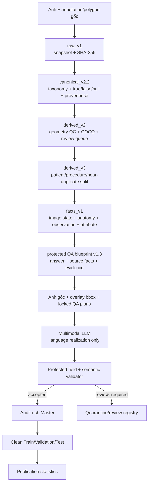

# Bronchoscopy-VQA v4.3

**Bronchoscopy-VQA v4.3** là bộ dữ liệu Visual Question Answering (VQA) tiếng Việt cho ảnh nội soi phế quản, được xây dựng theo hướng **fact-grounded**, **visually grounded** và **có thể kiểm toán**.

Release hiện hành `derived_v4.3-vision-full` có **27.570 cặp hỏi–đáp sạch trên 12.861 ảnh**. Ground truth, đáp án và vùng bằng chứng được khóa từ annotation trước khi mô hình ngôn ngữ tham gia. Multimodal LLM chỉ được phép diễn đạt lại câu hỏi, lý do và mô tả bằng chứng thị giác; mô hình không được thay đổi answer, question type, source facts hoặc bounding boxes.

> **Phạm vi repository công khai:** mã nguồn pipeline, schema, taxonomy, tài liệu phương pháp và thống kê tổng hợp. Ảnh nội soi, Master database và các clean split không được đưa lên GitHub cho đến khi hoàn tất de-identification, phê duyệt đạo đức, điều khoản sử dụng và giấy phép dữ liệu.

- Tài liệu phương pháp đầy đủ: [`docs/BRONCHOSCOPY_VQA_V4_3_PIPELINE.md`](docs/BRONCHOSCOPY_VQA_V4_3_PIPELINE.md)
- Bảng, hình và checksum thống kê: [`docs/publication_statistics/`](docs/publication_statistics/)


## Thông tin release

| Thuộc tính | Giá trị |
|---|---:|
| Release | `derived_v4.3-vision-full` |
| Record trong audit-rich Master | 28.025 |
| QA sạch trong Train/Validation/Test | **27.570** |
| QA giữ lại để review | 455 |
| Ảnh trong clean release | **12.861** |
| Bệnh nhân/quy trình | **1.606** |
| BBox instances | **28.853** |
| Cặp image–bbox độc nhất | **12.513** |
| QA có ít nhất một bbox | 25.435 (92,26%) |
| Kết quả audit cuối | `PASS` |

Không có giao nhau về `image_id`, `patient_id` hoặc `procedure_id` giữa Train, Validation và Test. Semantic validation cuối không ghi nhận failure hoặc protected-field conflict.

## Điểm chính của pipeline

- **Ground truth trước LLM:** answer, polarity, source facts và evidence được xác lập từ annotation và fact table.
- **Semantics ba trạng thái:** `true`, `false` và `null` được giữ riêng; thiếu annotation không bị diễn giải thành negative label.
- **Provenance đầy đủ:** mỗi QA có thể truy ngược qua fact, canonical region, annotation và polygon nguồn.
- **Split trước khi sinh QA:** dữ liệu được chia theo patient/procedure và nhóm ảnh exact/near-duplicate để ngăn leakage.
- **Protected blueprint:** các trường semantic quan trọng được đóng seal SHA-256 trước khi gọi LLM.
- **LLM có giới hạn:** mô hình chỉ paraphrase phần ngôn ngữ và mô tả bằng chứng nhìn thấy trong vùng đã chỉ định.
- **Quarantine thay vì đoán:** ảnh mờ, evidence không nhìn thấy hoặc fact–pixel conflict được chuyển sang review, không đi vào clean split.
- **Không suy diễn chẩn đoán sâu:** release hiện tại không có disease QA; pipeline chỉ hỏi về dấu hiệu quan sát được trực tiếp.

## Tổng quan quy trình



Pipeline gồm sáu lớp chính:

1. Đóng băng dữ liệu nguồn và checksum trong `raw_v1`.
2. Chuẩn hóa annotation, polygon, taxonomy và provenance thành `canonical_v2.2`.
3. Kiểm tra hình học, tạo COCO và khóa split ở cấp bệnh nhân/quy trình.
4. Tạo fact table và protected QA blueprint bằng luật xác định.
5. Dùng multimodal LLM để hiện thực hóa ngôn ngữ trong semantic contract đã khóa.
6. Validate, quarantine trường hợp không an toàn, xuất Master và ba clean split.

## Thống kê bộ dữ liệu sạch

### Phân chia dữ liệu

| Đại lượng | Train | Validation | Test | Tổng |
|---|---:|---:|---:|---:|
| Unique images | 9.121 | 1.892 | 1.848 | **12.861** |
| Unique patients | 1.074 | 264 | 268 | **1.606** |
| Unique procedures | 1.074 | 264 | 268 | **1.606** |
| QA pairs | 19.479 | 4.061 | 4.030 | **27.570** |
| BBox instances | 20.286 | 4.372 | 4.195 | **28.853** |
| Unique image–box tuples | 8.829 | 1.904 | 1.780 | **12.513** |

Việc chia dữ liệu được thực hiện trước khi sinh QA. Exact duplicate được phát hiện bằng SHA-256; near-duplicate được nhóm bằng pHash, dHash và tỷ lệ khung hình. Mục tiêu phân bổ nguồn là 70/15/15 với seed 42, nhưng số QA cuối phản ánh các record thực sự vượt qua validation, không bị ép về đúng tỷ lệ mục tiêu.

### Định dạng câu hỏi

| `q_type` | Số QA | Tỷ lệ |
|---|---:|---:|
| `closed_ended_questions` | 13.364 | 48,47% |
| `open_ended_questions` | 12.529 | 45,44% |
| `single_choice_questions` | 1.677 | 6,08% |


Pipeline không sinh distractor khi không có negative evidence đáng tin cậy, vì vậy release này không có multi-choice QA.

### Nội dung câu hỏi

| `question_type` | Số QA | Tỷ lệ |
|---|---:|---:|
| `abnormality` | 9.640 | 34,97% |
| `image_normality` | 6.374 | 23,12% |
| `abnormality_presence` | 5.426 | 19,68% |
| `stenosis_degree` | 1.677 | 6,08% |
| `secretion_type` | 1.253 | 4,54% |
| `secretion` | 949 | 3,44% |
| `stenosis_cause` | 688 | 2,50% |
| Các nhóm còn lại | 1.563 | 5,67% |

Các thống kê chi tiết về normality, anatomy, độ dài ngôn ngữ và word frequency nằm trong [`docs/publication_statistics/REPORT_VI.md`](docs/publication_statistics/REPORT_VI.md).


## Định dạng clean export

Mỗi record huấn luyện chỉ gồm bảy trường top-level:

```json
{
  "qa_id": "qa_<id>",
  "image": "relative/path/to/image.png",
  "conversations": [
    {
      "from": "human",
      "value": "<image>\nCâu hỏi <choices>: [...]"
    },
    {
      "from": "gpt",
      "value": "<answer> ... <reason> ... <visual_evidence> ... <location> [[x1,y1,x2,y2]]"
    }
  ],
  "question_type": "secretion_color",
  "q_type": "open_ended_questions",
  "evidence_boxes_xyxy": [[58, 22, 277, 199]],
  "answer_structured": {
    "concept": "secretion_color",
    "value": "bright_red"
  }
}
```

Clean export không chứa patient/procedure IDs, prompt, API trace, model metadata, protected seal hoặc review record. Những trường này chỉ được giữ trong Master nội bộ để kiểm toán.

## Cấu trúc mã nguồn công khai

```text
.
├── README.md
├── requirements-pipeline.txt
├── docs/
│   ├── BRONCHOSCOPY_VQA_V4_3_PIPELINE.md
│   └── publication_statistics/
└── dataset_versioning/
    ├── verify_raw_v1.py
    ├── build_canonical_v2_2.py
    ├── build_derived_v2.py
    ├── build_split_v3.py
    ├── build_vqa_v4.py
    ├── rebalance_vqa_polarity.py
    ├── audit_vqa_v4_1.py
    ├── build_vqa_v4_2.py
    ├── run_vqa_v4_2_vision_pilot.py
    ├── build_vqa_v4_3.py
    ├── run_vqa_v4_3_repair.py
    ├── run_vqa_v4_3_production.py
    ├── export_bronchoscopy_vqa_master_clean.py
    ├── analyze_vqa_v4_3_statistics.py
    ├── trace_vqa_provenance.py
    ├── canonical_schema_v2_1.json
    ├── bronchoscopy_taxonomy_v2.json
    └── systemd/
        └── bronchoscopy-vqa-v4-3.service.example
```

Các artifact `raw_v1`, `canonical_*`, `derived_*`, ảnh nguồn, Master database, clean splits và audit trace cấp record không thuộc repository công khai.

## Cài đặt

Yêu cầu Python 3.10–3.12.

```bash
git clone https://github.com/ngocdungpham/Gen_VQA.git
cd Gen_VQA

python -m venv .venv
source .venv/bin/activate
python -m pip install --upgrade pip
python -m pip install -r requirements-pipeline.txt
```

Các dependency chính gồm Pillow, JSON Schema, NumPy, SciPy, Shapely, Matplotlib, Requests và WordCloud.

## Tái tạo pipeline

> Các lệnh dưới đây cần private source artifacts được đặt đúng cấu trúc. Không commit ảnh bệnh nhân, annotation cấp record, API key hoặc đường dẫn định danh lên repository công khai.

### 1. Xác minh và chuẩn hóa dữ liệu

```bash
python dataset_versioning/verify_raw_v1.py

python dataset_versioning/build_canonical_v2_2.py create
python dataset_versioning/build_canonical_v2_2.py verify

python dataset_versioning/build_derived_v2.py create
python dataset_versioning/build_derived_v2.py verify

python dataset_versioning/build_split_v3.py create --seed 42
python dataset_versioning/build_split_v3.py verify
```

### 2. Tạo fact và protected QA blueprint

```bash
python dataset_versioning/build_vqa_v4.py facts
python dataset_versioning/build_vqa_v4.py blueprints
python dataset_versioning/build_vqa_v4.py finalize
python dataset_versioning/build_vqa_v4.py verify

python dataset_versioning/rebalance_vqa_polarity.py build
python dataset_versioning/rebalance_vqa_polarity.py verify

python dataset_versioning/build_vqa_v4_2.py blueprints
python dataset_versioning/build_vqa_v4_2.py audit-blueprints

python dataset_versioning/build_vqa_v4_3.py build
python dataset_versioning/build_vqa_v4_3.py audit
```

Các output versioned là immutable. Khi thử nghiệm lại, sử dụng một output directory/version mới thay vì ghi đè artifact đã đóng băng.

### 3. Pilot, repair và production

Đặt API key cho endpoint OpenAI-compatible bằng biến môi trường:

```bash
export VQA_LLM_API_KEY="YOUR_KEY"
```

Không ghi key vào source code, config được commit, systemd unit, manifest hoặc log.

Chạy pilot 100 ảnh:

```bash
python dataset_versioning/run_vqa_v4_2_vision_pilot.py prepare \
  --output-dir derived_v4_2_vision_pilot \
  --cohort-size 100

python dataset_versioning/run_vqa_v4_2_vision_pilot.py run \
  --output-dir derived_v4_2_vision_pilot \
  --base-url http://127.0.0.1:20128/v1 \
  --model GenVQAVer2

python dataset_versioning/run_vqa_v4_2_vision_pilot.py audit \
  --output-dir derived_v4_2_vision_pilot
```

Sau khi pilot đạt gate, chạy repair và production:

```bash
python dataset_versioning/run_vqa_v4_3_repair.py prepare
python dataset_versioning/run_vqa_v4_3_repair.py run \
  --base-url http://127.0.0.1:20128/v1 \
  --model GenVQAVer2
python dataset_versioning/run_vqa_v4_3_repair.py audit

python dataset_versioning/run_vqa_v4_3_production.py init
python dataset_versioning/run_vqa_v4_3_production.py preflight
python dataset_versioning/run_vqa_v4_3_production.py status
```

Production runner hỗ trợ cohort, checkpoint theo ảnh, resume, disk guard, timeout/retry, quarantine và user systemd. Xem hướng dẫn chạy dài hạn trong [tài liệu pipeline](docs/BRONCHOSCOPY_VQA_V4_3_PIPELINE.md#105-production-bằng-systemd-và-resume).

### 4. Tái tạo thống kê phát hành

```bash
python dataset_versioning/analyze_vqa_v4_3_statistics.py \
  --output-dir docs/publication_statistics
```

Script đối chiếu clean splits với Master, kiểm tra overlap và xuất bảng CSV/Markdown/LaTeX, hình PNG/PDF cùng checksum manifest.

## Kiểm soát chất lượng

Một candidate chỉ được đưa vào clean release khi:

- `image_id`, `qa_plan_id` và `qa_id` khớp request;
- protected seal khớp blueprint;
- source facts tồn tại trong đúng ảnh;
- evidence đúng bằng hợp evidence của các selected facts;
- answer, polarity và options khớp fact;
- question giữ đúng intent, anchor và vị trí bắt buộc;
- reason giữ các fact terms bắt buộc;
- không có answer leakage, polarity contradiction hoặc disease inference bị cấm;
- không trùng khóa `(image_id, normalize(question))`.

Kết quả cuối:

- 28.025 blueprint vượt qua pre-LLM semantic audit với 0 failure;
- 27.570 QA được xuất vào clean splits;
- 455 QA được giữ lại để review;
- 376 ảnh xuất hiện trong quarantine registry;
- không có leakage giữa các split theo image, patient hoặc procedure.

## Giới hạn và sử dụng có trách nhiệm

- Release chưa phải golden test đã được bác sĩ adjudicate hoàn chỉnh.
- 455 QA review và 376 ảnh quarantine không được tự động đưa lại vào training.
- Anatomy provenance hiện phủ 9.408/27.570 QA (34,12%).
- Bộ dữ liệu không có multi-choice hoặc disease QA.
- Explanation ngắn không tự động đồng nghĩa với reasoning có chất lượng lâm sàng.
- Không sử dụng test split để sửa prompt, chọn blueprint hoặc chọn checkpoint.
- Không sử dụng dữ liệu hoặc mô hình huấn luyện từ repository này như công cụ chẩn đoán hay thay thế quyết định của bác sĩ.
- Trước khi công khai ảnh hoặc clean splits phải hoàn tất de-identification, ethical approval, data-use terms và license phù hợp.

## Tài liệu

- [Mô tả đầy đủ pipeline và dataset statistics](docs/BRONCHOSCOPY_VQA_V4_3_PIPELINE.md)
- [Báo cáo thống kê tiếng Việt](docs/publication_statistics/REPORT_VI.md)
- [Bảng thống kê split](docs/publication_statistics/table_1_dataset_split_statistics.md)
- [Manifest và checksum phân tích](docs/publication_statistics/analysis_manifest.json)
- [Checklist phát hành GitHub](docs/GITHUB_RELEASE_CHECKLIST.md)

## Tham khảo

Thiết kế tài liệu và mục tiêu groundable/explainable được tham khảo từ:

> B. Liu et al., “GEMeX: A Large-Scale, Groundable, and Explainable Medical VQA Benchmark for Chest X-ray Diagnosis,” arXiv:2411.16778, 2025. <https://arxiv.org/abs/2411.16778>
