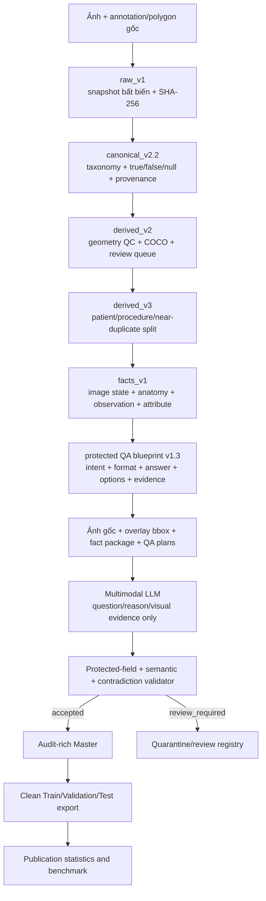

# Bronchoscopy-VQA: A Fact-Grounded, Visually Verified, and Explainable VQA Construction Pipeline

## Tóm tắt

Chúng tôi xây dựng Bronchoscopy-VQA, một bộ dữ liệu hỏi–đáp thị giác tiếng Việt cho ảnh nội soi phế quản, theo nguyên tắc **ground truth được xác lập trước khi mô hình ngôn ngữ tham gia**. Khác với pipeline report-to-VQA, trong đó mô hình ngôn ngữ có thể tự quyết định câu hỏi, đáp án và vùng bằng chứng, pipeline này chuyển annotation và polygon nguồn thành một canonical schema có semantics ba trạng thái, tạo fact table có provenance, đóng băng split ở cấp bệnh nhân/quy trình/nhóm ảnh gần trùng, sau đó xây dựng QA blueprint chứa đáp án và evidence đã khóa. Mô hình đa phương thức chỉ quan sát ảnh gốc, overlay bbox và fact package để viết lại câu hỏi, giải thích ngắn và mô tả bằng chứng trực quan; mô hình không được thay đổi answer, options, source facts, evidence hoặc question type.

Release cuối `derived_v4.3-vision-full` chứa 28.025 record trong Master. Sau hậu kiểm, 27.570 QA đạt chuẩn được xuất thành Train/Validation/Test và 455 QA được giữ ở trạng thái review. Bộ sạch gồm 12.861 ảnh, 1.606 bệnh nhân/quy trình, 28.853 bbox instances và 12.513 cặp image–bbox độc nhất. Audit cuối đạt `PASS`, không có semantic failure, protected-field conflict hoặc leakage giữa các split.

Tài liệu được tổ chức theo phong cách phần *Dataset Construction* và *Dataset Statistics* của GEMeX [1], nhưng mọi số liệu và mô tả dưới đây được lấy từ artifact thực tế của Bronchoscopy-VQA.

## 1. Động cơ và thiết kế tổng thể

VQA y khoa cần đồng thời thỏa ba điều kiện: câu trả lời đúng, lý do có căn cứ và vị trí thị giác phù hợp. Một pipeline cho phép LLM sinh tự do cả ba thành phần có thể tạo ngôn ngữ đa dạng nhưng làm suy yếu tính truy vết tới annotation nguồn. Rủi ro đặc biệt nghiêm trọng trong nội soi phế quản, nơi biểu hiện đại thể như tổn thương sùi, loét hoặc dễ chảy máu không đủ để khẳng định chẩn đoán mô bệnh học.

Pipeline của chúng tôi tách rõ hai tầng quyết định:

1. **Semantic and evidence layer:** annotation bác sĩ, polygon, canonical labels, fact, answer và evidence được xác lập bằng luật xác định.
2. **Language realization layer:** LLM quan sát ảnh và bằng chứng đã chỉ định để paraphrase question/reason và mô tả dấu hiệu trực quan.



## 2. Giai đoạn I — Chuẩn bị, chuẩn hóa và tái gắn bằng chứng

### 2.1. Đóng băng dữ liệu nguồn

Các annotation, label, metadata và report nguồn được đóng gói thành snapshot `raw_v1.0`. Mỗi file và bundle có SHA-256; script verifier chỉ đọc artifact đã đóng băng, không đối chiếu hoặc sửa trực tiếp thư mục làm việc. Snapshot gồm 5.184 file nguồn. Mọi thay đổi về annotation phải tạo version mới thay vì sửa `raw_v1`.

Mục đích của bước này là bảo đảm một release downstream luôn có thể truy về đúng byte nguồn đã sử dụng. API key, token, ảnh bệnh nhân và log chứa thông tin nhạy cảm không thuộc artifact công khai.

### 2.2. Canonical schema và semantics ba trạng thái

Nguồn annotation không đồng nhất được chuẩn hóa thành `canonical_v2.2`. Mỗi ảnh có một `image_id` ổn định; các polygon đồng hình trong cùng ảnh được gộp thành một canonical region đa nhãn. Polygon gốc và `source_annotation_ids` vẫn được giữ để kiểm toán.

Ba trạng thái được bảo toàn tuyệt đối:

| Giá trị | Diễn giải | Có được sinh negative QA? |
|---|---|---|
| `true` | Concept được xác nhận có | Không; dùng làm positive fact |
| `false` | Concept được xác nhận không có | Có, nếu fact đủ điều kiện |
| `null` | Không được gán nhãn hoặc chưa xác định | Không |

Việc một concept không xuất hiện trong mảng positive-only không được diễn giải thành `false`. Quy tắc này ngăn pipeline tạo câu trả lời “Không” chỉ vì annotation bị thiếu.

Kết quả canonical:

| Đại lượng | Số lượng |
|---|---:|
| Canonical images | 30.255 |
| Canonical regions | 41.026 |
| Source polygon annotations | 49.386 |
| Polygon annotations được gộp | 8.360 |
| Ảnh có region | 27.425 |
| Ảnh thiếu/lỗi asset | 429 |
| `normal=true` | 1.292 |
| `normal=false` | 11.698 |
| `normal=null` | 17.265 |

### 2.3. Tiền xử lý hình học và quality status

`derived_v2.0` tạo một lớp biến đổi có thể hoàn tác. Canonical polygon của bác sĩ không bị sửa; mọi clipping hoặc chuẩn hóa kỹ thuật được lưu riêng thành `training_polygon`. Polygon được kiểm tra tính hợp lệ, biên ảnh, diện tích và overlap. Các trường hợp không an toàn được chuyển vào review queue thay vì tự sửa nhãn.

Artifact COCO chứa đồng thời bbox và segmentation, cho phép tái sử dụng cùng nguồn bằng chứng cho detection, segmentation và VQA. Kết quả gồm 38.990 COCO annotations trên 26.572 ảnh; 1.574 canonical regions và 1.106 ảnh được đánh dấu cần review ở lớp tiền xử lý.

### 2.4. Chia dữ liệu trước khi sinh QA

Split được khóa tại `derived_v3.0` trước khi tạo fact hoặc QA. Đơn vị chia không phải câu hỏi mà là leakage group gồm bệnh nhân, quy trình và các ảnh exact/near-duplicate có liên hệ.

Exact duplicate được phát hiện bằng SHA-256. Near-duplicate được nối nhóm khi đồng thời thỏa:

- pHash DCT 64-bit: Hamming distance ≤ 4;
- dHash 64-bit: Hamming distance ≤ 4;
- sai khác tỷ lệ khung hình tương đối ≤ 0,01.

Các leakage group được phân bổ xác định với seed 42 và mục tiêu 70/15/15, có phân tầng đa nhãn trên mucosal, tumor, stenosis, secretion và normal.

| Split nguồn | Ảnh | Tỷ lệ ảnh | Bệnh nhân/quy trình |
|---|---:|---:|---:|
| Train | 21.179 | 70,00% | 1.289 |
| Validation | 4.538 | 15,00% | 350 |
| Test | 4.538 | 15,00% | 346 |
| **Tổng** | **30.255** | **100%** | **1.985** |

Trong release VQA sạch, giao nhau về `image_id`, `patient_id` và `procedure_id` giữa mọi cặp split đều bằng 0.

## 3. Giai đoạn II — Tạo fact và evidence có provenance

### 3.1. Fact table

Mỗi ảnh được chuyển thành một fact record chứa metadata ảnh, canonical regions và danh sách fact. Bốn loại fact được sử dụng:

| `fact_kind` | Chức năng | Ví dụ |
|---|---|---|
| `image_state` | Trạng thái toàn ảnh | `image_normal=false` |
| `anatomy` | Vùng giải phẫu | `left_main_bronchus` |
| `observation` | Dấu hiệu quan sát được | `stenosis`, `mucosal_erythema` |
| `attribute` | Thuộc tính của observation cha | `stenosis_severity=51_75_percent` |

Một fact điển hình giữ các trường:

```json
{
  "fact_id": "fact_<stable_hash>",
  "fact_kind": "attribute",
  "concept": "secretion_color",
  "concept_family": "color",
  "value": "bright_red",
  "polarity": "present",
  "certainty": "confirmed",
  "anatomical_locations": ["left_main_bronchus"],
  "parent_fact_id": "fact_<parent>",
  "source_annotation_ids": ["annotation_<id>"],
  "evidence_region_ids": ["canonical_region_<id>"],
  "question_eligible": true
}
```

Fact statistics:

| Nhóm | Số lượng |
|---|---:|
| Tổng fact | 68.587 |
| Fact đủ điều kiện sinh QA | 34.630 |
| Anatomy | 32.205 |
| Observation | 18.922 |
| Attribute | 4.470 |
| Image state | 12.990 |
| Polarity `present` | 55.355 |
| Polarity `absent` | 13.232 |

### 3.2. Evidence regions và bounding boxes

`evidence_region_ids` là liên kết chính giữa fact và polygon canonical. Khi chuẩn bị request cho LLM, mỗi evidence region được materialize thành:

- `evidence_region_id`;
- chỉ số hiển thị trên overlay;
- bbox `xyxy` theo pixel;
- bbox `xyxy` chuẩn hóa về thang 0–1000;
- anatomical locations nếu có;
- `source_annotation_ids`.

Pipeline không tạo fact `region_extent` và không suy ra kích thước bệnh lý chỉ từ tỷ lệ diện tích bbox. Bbox là vùng bằng chứng, không tự động đại diện cho ranh giới hoàn chỉnh của tổn thương.

## 4. Xây dựng semantic QA blueprint

### 4.1. Ground truth được quyết định trước LLM

Blueprint xác định trước:

- `question_format` và `question_intent`;
- `answer_structured` và `answer_text`;
- đáp án lựa chọn đúng trong `options`;
- `source_fact_ids`;
- `evidence_region_ids`;
- `question_draft` và `reasoning_text_draft`;
- anchor bắt buộc trong câu hỏi và fact terms bắt buộc trong reason.

Năm trường semantic/provenance được đóng seal SHA-256:

```text
source_fact_ids
answer_structured
answer_text
options
evidence_region_ids
```

`protected_sha256` hoàn toàn do hệ thống sở hữu. LLM không phải sao chép checksum; pipeline tự lấy seal từ blueprint, tính lại trên payload và ghi `transport_normalizations` nếu model echo một giá trị khác.

### 4.2. Sửa câu hỏi thuộc tính mơ hồ

Audit v4.1 phát hiện cùng một câu hỏi chung về “đặc điểm dịch tiết” có thể trỏ tới loại, màu hoặc độ đặc khác nhau. `derived_v4.2` thay thế template chung bằng template riêng:

| Intent | Mẫu semantic |
|---|---|
| `secretion_type` | Loại dịch tiết nào được ghi nhận tại vị trí này? |
| `secretion_color` | Màu của dịch tiết tại vị trí này là gì? |
| `secretion_consistency` | Độ đặc hoặc hình thái của dịch tiết tại vị trí này là gì? |
| `tumor_morphology` | Hình thái của khối u khí phế quản tại vị trí này là gì? |
| `stenosis_cause` | Nguyên nhân hình thái của hẹp lòng phế quản là gì? |

Nếu cùng concept, ảnh và vị trí có nhiều giá trị không thể phân biệt bằng wording, pipeline gộp chúng thành answer đa nhãn. Việc này làm số blueprint giảm từ 28.026 xuống 28.025 và loại bỏ collision `(image_id, normalize(question_draft))`.

### 4.3. Blueprint v1.3 và semantic gate

`bronchoscopy_qa_blueprints_v1.3` sửa hai loại xung đột:

- 746 QA chỉ có fact bình thường được chuyển từ abnormality QA sang normal-finding QA theo vùng;
- 41 QA có cả normal và abnormal facts được loại normal fact khỏi answer “những bất thường nào”.

27.238 blueprint không đổi semantic contract được carry forward. QA thay đổi intent, answer hoặc source facts nhận `qa_id` và protected seal mới. Audit v1.3 kiểm tra toàn bộ 28.025 blueprint và đạt semantic failure bằng 0 trước khi mở LLM production.

## 5. Sinh VQA bằng multimodal LLM

### 5.1. Vai trò và quyền hạn của LLM

| Thành phần | LLM có quyền quyết định? | Nguồn quyết định |
|---|:---:|---|
| Số QA trên ảnh | Không | Blueprint |
| Question type/intent | Không | Blueprint |
| Answer và polarity | Không | Fact + blueprint |
| Options/đáp án đúng | Không | Blueprint |
| Source facts | Không | Blueprint |
| Evidence/bbox | Không | Canonical provenance |
| Cách diễn đạt câu hỏi | Có, trong anchor bắt buộc | LLM |
| Cách diễn đạt reason | Có, phải giữ fact terms | LLM |
| `visual_evidence_summary` | Có, dựa trên pixel vùng chỉ định | LLM |
| Chuyển mẫu sang review | Có, với reason code giới hạn | LLM + validator |

Alias gọi API là `GenVQAVer2`; các trace hoàn thành ghi nhận backend trả về `gpt-5.6-luna`. Nhiệt độ production là 0,25. Tên alias, response model, prompt hash, response ID và token usage được giữ trong Master để audit nhưng bị loại khỏi clean training export.

### 5.2. Input gửi cho LLM

Mỗi request tương ứng một ảnh và chứa:

1. ảnh nội soi gốc;
2. ảnh overlay toàn khung có bbox đánh số;
3. kích thước ảnh và split;
4. evidence region package;
5. exact supporting facts;
6. một hoặc nhiều locked QA plans của ảnh;
7. policy: `visual_evidence_summary=true`, `roi_crops=false`, `region_extent_fact=false`.

Không sử dụng ROI crop. Cách này giữ ngữ cảnh giải phẫu toàn ảnh trong khi overlay hướng mô hình tới evidence cần quan sát.

Schema rút gọn của một plan:

```json
{
  "qa_plan_id": "plan_<id>",
  "qa_id": "qa_<id>",
  "question_format": "open-ended",
  "question_intent": "secretion_color",
  "question_draft": "Màu của dịch tiết tại ... là gì?",
  "reasoning_text_draft": "Vùng bằng chứng ... cho thấy đỏ tươi.",
  "answer_structured_locked": {
    "concept": "secretion_color",
    "value": "bright_red"
  },
  "answer_text_locked": "Đỏ tươi.",
  "options_locked": {},
  "source_fact_ids": ["fact_<id>"],
  "evidence_region_ids": ["canonical_region_<id>"],
  "required_question_anchors": [["màu"], ["dịch tiết"]],
  "required_reason_terms": ["đỏ tươi"],
  "disease_policy": {"mode": "abnormality_only"}
}
```

### 5.3. Output được phép

Model chỉ trả:

```json
{
  "image_id": "image_<id>",
  "items": [
    {
      "qa_plan_id": "plan_<id>",
      "qa_id": "qa_<id>",
      "status": "accepted",
      "review_reasons": [],
      "question": "...",
      "reasoning_text": "...",
      "visual_evidence_summary": "..."
    }
  ]
}
```

Với `review_required`, ba trường text phải là `null`; reason chỉ được lấy từ: `image_unclear`, `evidence_not_visible`, `evidence_region_mismatch`, `fact_pixel_conflict`, `ambiguous_location`, `unsafe_clinical_inference`.

### 5.4. Chính sách bệnh và suy luận lâm sàng

Disease QA chỉ được phép nếu source fact nằm trong một whitelist bệnh có biểu hiện đặc hiệu, nhìn thấy trực tiếp trên ảnh tĩnh. Các biểu hiện đại thể như `bronchial_tumor`, tumor morphology, ulceration hoặc infiltration không được dùng để suy ra ung thư, carcinoma, lao, mô bệnh học, tế bào học, di căn, tiên lượng hoặc điều trị.

Trong release hiện tại, whitelist disease fact được chứng nhận là rỗng; do đó không có QA `disease`. Pipeline hỏi về abnormality quan sát được, chẳng hạn hình thái tổn thương sùi hoặc dễ chảy máu, thay vì khẳng định chẩn đoán sâu.

### 5.5. Ví dụ minh họa: từ polygon nguồn đến hội thoại huấn luyện

Xét một ảnh đã được khử định danh, trong đó annotation nguồn đánh dấu dịch tiết bất thường tại phế quản gốc trái. Polygon được gán kèm hai thuộc tính: loại dịch tiết là máu và độ đặc có dạng cục. Ví dụ này giữ nguyên cấu trúc của pipeline production; các mã định danh đã được rút gọn và không hiển thị thông tin bệnh nhân.

**Bước 1 — Chuẩn hóa annotation nguồn.** Polygon nguồn và các nhãn tương ứng được hợp nhất thành một canonical region đa nhãn. Mã annotation gốc tiếp tục được giữ làm provenance, trong khi hình học của region được chuyển thành bounding box theo tọa độ pixel để phục vụ visual grounding.

```json
{
  "canonical_region_id": "canonical_region_<R1>",
  "anatomy": ["left_main_bronchus"],
  "bbox_xyxy_pixels": [58, 22, 277, 199],
  "source_annotation_ids": ["annotation_<A1>"],
  "labels": {
    "secretion": true,
    "secretion_type": "blood",
    "secretion_consistency": "clotted"
  }
}
```

**Bước 2 — Xây dựng bằng chứng dựa trên fact.** Các canonical label được phân rã thành một observation fact và hai attribute fact. Mỗi attribute fact liên kết với observation về dịch tiết thông qua `parent_fact_id`; cả ba fact đều giữ nguyên evidence region và annotation nguồn.

```json
[
  {
    "fact_id": "fact_<F1>",
    "fact_kind": "observation",
    "concept": "secretion",
    "value": true,
    "polarity": "present",
    "anatomical_locations": ["left_main_bronchus"],
    "evidence_region_ids": ["canonical_region_<R1>"]
  },
  {
    "fact_id": "fact_<F2>",
    "fact_kind": "attribute",
    "concept": "secretion_type",
    "value": "blood",
    "polarity": "present",
    "parent_fact_id": "fact_<F1>",
    "evidence_region_ids": ["canonical_region_<R1>"]
  },
  {
    "fact_id": "fact_<F3>",
    "fact_kind": "attribute",
    "concept": "secretion_consistency",
    "value": "clotted",
    "polarity": "present",
    "parent_fact_id": "fact_<F1>",
    "evidence_region_ids": ["canonical_region_<R1>"]
  }
]
```

**Bước 3 — Tạo protected blueprint không mơ hồ.** Thay vì đặt một câu hỏi chung về “đặc điểm” của dịch tiết, pipeline tạo QA plan riêng cho thuộc tính loại dịch tiết. Trước khi gọi LLM, đáp án, source fact và evidence region đã được hệ thống cố định và đóng seal.

```json
{
  "qa_plan_id": "plan_<P1>",
  "qa_id": "qa_<Q1>",
  "question_format": "open-ended",
  "question_intent": "secretion_type",
  "question_draft": "Loại dịch tiết nào được ghi nhận tại phế quản gốc trái?",
  "reasoning_text_draft": "Vùng bằng chứng tại phế quản gốc trái cho thấy máu.",
  "answer_structured_locked": {
    "concept": "secretion_type",
    "value": "blood"
  },
  "answer_text_locked": "Máu.",
  "options_locked": {},
  "source_fact_ids": ["fact_<F2>"],
  "evidence_region_ids": ["canonical_region_<R1>"],
  "required_question_anchors": [["loại"], ["dịch tiết"]],
  "required_reason_terms": ["máu"]
}
```

Fact về độ đặc dạng cục không được gộp vào đáp án này. Fact đó tạo một blueprint riêng để hỏi về `secretion_consistency`. Việc tách câu hỏi theo từng thuộc tính ngăn hai ground truth khác nhau cùng sử dụng một khóa ảnh–câu hỏi.

**Bước 4 — Hiện thực hóa cách diễn đạt bằng LLM đa phương thức.** LLM nhận ảnh gốc, ảnh overlay toàn khung có bounding box được đánh số, fact package đã chọn và QA plan đã khóa. Mô hình chỉ được phép viết lại câu hỏi, reason và mô tả những dấu hiệu thực sự quan sát được. Một response hợp lệ có thể có dạng:

```json
{
  "image_id": "image_<I1>",
  "items": [
    {
      "qa_plan_id": "plan_<P1>",
      "qa_id": "qa_<Q1>",
      "status": "accepted",
      "review_reasons": [],
      "question": "Tại phế quản gốc trái, loại dịch tiết nào đang hiện diện?",
      "reasoning_text": "Tại vùng quan sát ở phế quản gốc trái có máu.",
      "visual_evidence_summary": "Trong vùng được định vị có chất dịch màu đỏ sẫm, khu trú trong lòng phế quản."
    }
  ]
}
```

LLM không trả về answer, options, mã fact, mã evidence hoặc protected checksum. Pipeline tự lấy lại các trường này từ blueprint và gắn vào candidate sau khi nhận response.

**Bước 5 — Kiểm tra protected fields và ngữ nghĩa.** Candidate chỉ được chấp nhận khi: (i) `qa_plan_id` và `qa_id` khớp với request; (ii) câu hỏi vẫn giữ anchor về loại dịch tiết và vị trí giải phẫu; (iii) reason chứa thuật ngữ bắt buộc “máu”; (iv) câu hỏi không làm lộ đáp án; (v) giá trị answer `blood` phù hợp với `fact_<F2>`; và (vi) evidence chính xác là `canonical_region_<R1>`. Nếu pixel không thể hiện rõ fact, candidate được chuyển sang `review_required` thay vì để LLM tự sửa đáp án.

**Bước 6 — Materialize record huấn luyện sạch.** Sau validation, hệ thống kết hợp phần diễn đạt do LLM tạo với answer và bbox đã khóa:

```json
{
  "qa_id": "qa_<Q1>",
  "image": "relative/path/to/image.png",
  "conversations": [
    {
      "from": "human",
      "value": "<image>\nTại phế quản gốc trái, loại dịch tiết nào đang hiện diện?"
    },
    {
      "from": "gpt",
      "value": "<answer> Máu. <reason> Tại vùng quan sát ở phế quản gốc trái có máu. <visual_evidence> Trong vùng được định vị có chất dịch màu đỏ sẫm, khu trú trong lòng phế quản. <location> [[58, 22, 277, 199]]"
    }
  ],
  "question_type": "secretion_type",
  "q_type": "open_ended_questions",
  "evidence_boxes_xyxy": [[58, 22, 277, 199]],
  "answer_structured": {
    "concept": "secretion_type",
    "value": "blood"
  }
}
```

Ví dụ trên cho thấy sự phân chia trách nhiệm trong pipeline đề xuất: các lớp annotation và fact quyết định *điều gì là đúng* và *bằng chứng hỗ trợ nằm ở đâu*, còn LLM chỉ quyết định *QA có căn cứ đó được diễn đạt như thế nào*.

**Đối chiếu bằng artifact thật.** Repository cung cấp một tracer chỉ đọc để truy ngược một `qa_id` qua toàn bộ chuỗi provenance mà không cần `jq`:

```bash
python dataset_versioning/trace_vqa_provenance.py \
  --qa-id qa_14cb337493430955454e7c1c
```

Với ví dụ này, tracer trả về đường dẫn và vị trí record trong: ảnh nguồn, `annotation.json`, canonical record, `facts_v1`, blueprint v1.3, system prompt, request gửi LLM, ảnh overlay, raw response, accepted candidate, Master và clean split. Nó đồng thời kiểm tra ba bất biến: tập `source_fact_ids` được tìm thấy đầy đủ, `evidence_region_ids` đúng bằng evidence của selected facts, và `protected_sha256` của blueprint khớp Master. Đường dẫn ca bệnh chi tiết chỉ nên lưu trong báo cáo audit nội bộ; thư mục `docs/internal/` đã bị loại khỏi Git để tránh vô tình công khai dữ liệu giả danh.

## 6. Kiểm soát chất lượng

### 6.1. Protected-field và semantic validator

Một candidate chỉ được chấp nhận khi đồng thời thỏa:

- `image_id`, `qa_plan_id`, `qa_id` khớp request;
- đủ đúng một output cho mỗi QA plan;
- protected seal của blueprint hợp lệ;
- source fact tồn tại trong đúng ảnh;
- evidence là hợp chính xác của evidence từ selected facts;
- answer concept/value/polarity/options khớp fact;
- question giữ attribute anchor và vị trí bắt buộc;
- reason giữ nguyên các required fact terms;
- question và reason thực sự khác draft sau chuẩn hóa;
- question không tiết lộ answer;
- không có polarity contradiction;
- không có từ/cụm từ suy luận bệnh bị cấm;
- không trùng khóa `(image_id, normalize(question))`.

Answer, options, facts, evidence, intent và format luôn được lấy lại từ protected blueprint, không lấy từ output tự do của model.

### 6.2. Pilot gate

Pilot sử dụng 100 ảnh theo quota Train/Validation/Test 70/15/15. Điều kiện mở production gồm:

- automatic acceptance ≥ 95%;
- protected/semantic/contradiction failure = 0;
- question collision = 0;
- review thủ công các trường hợp bị đánh dấu.

Sau khi nâng blueprint lên v1.3, 878/920 QA pilot không đổi protected contract được carry forward và kiểm chứng lại; chỉ 42 QA repaired được gọi LLM lại. Repair audit đạt `PASS_READY_FOR_EXPORT` với 0 failure.

### 6.3. Production runner

Production được chia thành cohort tối đa 100 ảnh và checkpoint atomically sau mỗi ảnh. Runner hỗ trợ resume, preflight, disk guard, timeout/retry và systemd. Cấu hình của run cuối:

| Tham số | Giá trị |
|---|---:|
| Cohort size | 100 ảnh |
| Request timeout | 300 giây |
| API retries mỗi lần chạy | 2 |
| Minimum free disk | 10 GiB |
| Minimum acceptance target | 95% |
| Maximum review rate | 5% |
| Consecutive uncheckpointed failures | 3 |
| Restart backoff | 120 giây |

Lỗi hạ tầng được chờ và retry cùng ảnh. Ảnh có model review, source annotation đáng ngờ hoặc thất bại lặp lại được ghi vào quarantine để production tiếp tục; record vẫn được giữ trong Master nhưng không vào clean splits.

### 6.4. Quarantine và audit trail

Có 376 ảnh trong quarantine registry và 455 QA ở trạng thái review. Một ảnh có thể mang nhiều issue nên tổng issue count lớn hơn số ảnh.

| Issue | Số lượt |
|---|---:|
| `evidence_not_visible` | 240 |
| `fact_pixel_conflict` | 104 |
| `image_unclear` | 60 |
| `evidence_region_mismatch` | 35 |
| `unsafe_clinical_inference` | 15 |
| `generation_failure_after_retries` | 5 |
| `ambiguous_location` | 1 |

Ba trường hợp source annotation đặc thù khác được mô tả bằng note tự do trong registry và chờ adjudication.

## 7. Materialization và định dạng phát hành

Hai lớp output được duy trì:

1. **Master database:** giữ patient/procedure IDs, source facts, evidence IDs, protected seals, LLM trace, drafts, review reasons và transport normalization để kiểm toán.
2. **Clean Train/Validation/Test:** chỉ giữ bảy trường phục vụ huấn luyện.

```json
{
  "qa_id": "qa_<id>",
  "image": "relative/path/to/image.png",
  "conversations": [
    {
      "from": "human",
      "value": "<image>\nCâu hỏi <choices>: [...]"
    },
    {
      "from": "gpt",
      "value": "<answer> ... <reason> ... <visual_evidence> ... <location> [[x1,y1,x2,y2]]"
    }
  ],
  "question_type": "secretion_color",
  "q_type": "open_ended_questions",
  "evidence_boxes_xyxy": [[x1, y1, x2, y2]],
  "answer_structured": {
    "concept": "secretion_color",
    "value": "bright_red"
  }
}
```

Review-required rows không đi vào clean split. Final export đọc lại toàn bộ file trên đĩa và xác nhận đúng bảy top-level fields trước khi phát hành.

## 8. Thống kê bộ dữ liệu

### 8.1. Dataset split

| Đại lượng | Train | Validation | Test | Tổng |
|---|---:|---:|---:|---:|
| Unique images | 9.121 | 1.892 | 1.848 | **12.861** |
| Unique patients | 1.074 | 264 | 268 | **1.606** |
| Unique procedures | 1.074 | 264 | 268 | **1.606** |
| QA pairs | 19.479 | 4.061 | 4.030 | **27.570** |
| BBox instances | 20.286 | 4.372 | 4.195 | **28.853** |
| Unique image–box tuples | 8.829 | 1.904 | 1.780 | **12.513** |

25.435 QA (92,26%) có ít nhất một bbox. 2.135 QA không có bbox đều là `image_normality` ở cấp toàn ảnh. Không có bbox có tọa độ không hợp lệ.

### 8.2. Question format

| `q_type` | Số QA | Tỷ lệ |
|---|---:|---:|
| `closed_ended_questions` | 13.364 | 48,47% |
| `open_ended_questions` | 12.529 | 45,44% |
| `single_choice_questions` | 1.677 | 6,08% |
| `multi_choice_questions` | 0 | 0% |

Multi-choice không được tạo vì pipeline không sinh distractor nếu thiếu negative evidence đáng tin cậy.

### 8.3. Question content

| `question_type` | Số QA | Tỷ lệ |
|---|---:|---:|
| `abnormality` | 9.640 | 34,97% |
| `image_normality` | 6.374 | 23,12% |
| `abnormality_presence` | 5.426 | 19,68% |
| `stenosis_degree` | 1.677 | 6,08% |
| `secretion_type` | 1.253 | 4,54% |
| `secretion` | 949 | 3,44% |
| `stenosis_cause` | 688 | 2,50% |
| Các nhóm còn lại | 1.563 | 5,67% |

### 8.4. Normality

Trong 6.374 QA `image_normality`, 1.062 QA có `normal=true` (16,66%) và 5.312 QA có `normal=false` (83,34%). Đây là phân bố QA/image-normality, không phải prevalence ở cấp bệnh nhân và không tự nó chứng minh dữ liệu đã cân bằng tối ưu.

### 8.5. Language and explainability

| Thành phần | Mean | Median | P25–P75 | P95 | Max |
|---|---:|---:|---:|---:|---:|
| Question stem | 11,97 | 12 | 10–13 | 16 | 28 |
| Reason | 14,68 | 14 | 11–17 | 22 | 39 |
| Visual evidence | 15,14 | 15 | 13–17 | 20 | 30 |
| Reason + visual evidence | 29,82 | 29 | 26–34 | 40 | 61 |

Độ dài được tính bằng Unicode lexical tokens; trong tiếng Việt, các âm tiết ngăn cách bằng khoảng trắng được tính riêng. Explanation của Bronchoscopy-VQA ngắn gọn hơn GEMeX. Độ dài không được sử dụng như bằng chứng duy nhất về chất lượng reasoning.

### 8.6. Anatomy coverage

9.408/27.570 QA (34,12%) có anatomical region xác định trực tiếp từ canonical provenance. 18.162 QA còn lại có evidence nhưng canonical region chưa mang anatomy label; pipeline không ép gán vùng bằng text do LLM sinh. Figure anatomy báo cáo QA–anatomy associations và có thể là multi-label.


Các CSV, LaTeX table, PDF vector và checksum nằm tại [`docs/publication_statistics`](publication_statistics/).

## 9. So sánh phương pháp với GEMeX

GEMeX tái gắn report X-quang với vùng giải phẫu bằng medical LLM, sau đó dùng GPT-4o sinh câu hỏi, answer, reason và location từ report đã re-ground. Bronchoscopy-VQA kế thừa tư tưởng groundable/explainable nhưng chuyển quyền quyết định ground truth khỏi LLM.

| Thành phần | GEMeX | Bronchoscopy-VQA v4.3 |
|---|---|---|
| Nguồn semantic | Re-grounded report | Canonical fact table |
| Vai trò LLM | Sinh QA, answer, reason, location | Chỉ paraphrase question/reason và mô tả visual evidence |
| Answer | Do generator sinh | Khóa trước từ fact |
| Evidence | Location text rồi map bbox | Khóa trực tiếp bằng canonical region |
| Provenance | Report–region mapping | QA → fact → annotation → polygon |
| Hình ảnh gửi generator | Report-grounded generation | Ảnh gốc + overlay bbox + fact package |
| ROI crop | Không phải trọng tâm | Không sử dụng |
| Disease inference | Theo report X-quang | Whitelist biểu hiện nhìn thấy; release hiện tại có 0 disease QA |
| Question formats | Open, closed, single, multi | Open, closed, single |
| Quality gate | Prompt refinement + expert review | Protected seal + semantic validator + quarantine + audit |

Sự khác biệt này giảm không gian sáng tạo của LLM nhưng làm answer và evidence có thể kiểm toán. Đổi lại, bộ dữ liệu hiện không có multi-choice, explanation tương đối ngắn và anatomy coverage còn hạn chế.

## 10. Cài đặt và tái lập

### 10.1. Môi trường

```bash
git clone https://github.com/ngocdungpham/Gen_VQA.git
cd Gen_VQA

python -m venv .venv
source .venv/bin/activate
python -m pip install --upgrade pip
python -m pip install -r requirements-pipeline.txt
```

Python 3.10–3.12 được khuyến nghị. Systemd chỉ cần cho production runner dài hạn.

### 10.2. Kiểm tra và tái tạo các tầng deterministic

Các lệnh sau giả định private artifacts đã được đặt đúng vị trí. Không commit dữ liệu bệnh nhân lên repository công khai.

```bash
python dataset_versioning/verify_raw_v1.py

python dataset_versioning/build_canonical_v2_2.py create
python dataset_versioning/build_canonical_v2_2.py verify

python dataset_versioning/build_derived_v2.py create
python dataset_versioning/build_derived_v2.py verify

python dataset_versioning/build_split_v3.py create --seed 42
python dataset_versioning/build_split_v3.py verify

python dataset_versioning/build_vqa_v4.py facts
python dataset_versioning/build_vqa_v4.py blueprints
python dataset_versioning/build_vqa_v4.py finalize
python dataset_versioning/build_vqa_v4.py verify

python dataset_versioning/rebalance_vqa_polarity.py build
python dataset_versioning/rebalance_vqa_polarity.py verify

python dataset_versioning/build_vqa_v4_2.py blueprints
python dataset_versioning/build_vqa_v4_2.py audit-blueprints

python dataset_versioning/build_vqa_v4_3.py build
python dataset_versioning/build_vqa_v4_3.py audit
```

Các output versioned là immutable; dùng `--output-dir <new_version>` khi chạy thử lại để không đè artifact đã đóng băng.

### 10.3. Cấu hình endpoint OpenAI-compatible/9Router

```bash
export VQA_LLM_API_KEY="local-or-provider-key"
```

Production config mặc định:

```json
{
  "base_url": "http://127.0.0.1:20128/v1",
  "model": "GenVQAVer2"
}
```

Không ghi key vào `config.json`, systemd unit, manifest hoặc log. Nếu dùng systemd, đặt biến vào file ngoài repository với permission `600`:

```bash
mkdir -p ~/.config
printf 'VQA_LLM_API_KEY=%s\n' 'YOUR_KEY' > ~/.config/bronchoscopy-vqa-v4-3.env
chmod 600 ~/.config/bronchoscopy-vqa-v4-3.env
```

### 10.4. Pilot và repair

```bash
python dataset_versioning/run_vqa_v4_2_vision_pilot.py prepare \
  --output-dir derived_v4_2_vision_pilot \
  --cohort-size 100

python dataset_versioning/run_vqa_v4_2_vision_pilot.py run \
  --output-dir derived_v4_2_vision_pilot \
  --base-url http://127.0.0.1:20128/v1 \
  --model GenVQAVer2

python dataset_versioning/run_vqa_v4_2_vision_pilot.py audit \
  --output-dir derived_v4_2_vision_pilot

python dataset_versioning/run_vqa_v4_3_repair.py prepare
python dataset_versioning/run_vqa_v4_3_repair.py run \
  --base-url http://127.0.0.1:20128/v1 \
  --model GenVQAVer2
python dataset_versioning/run_vqa_v4_3_repair.py audit
```

### 10.5. Production bằng systemd và resume

```bash
python dataset_versioning/run_vqa_v4_3_production.py init
python dataset_versioning/run_vqa_v4_3_production.py preflight

mkdir -p ~/.config/systemd/user
cp dataset_versioning/systemd/bronchoscopy-vqa-v4-3.service.example \
  ~/.config/systemd/user/bronchoscopy-vqa-v4-3.service
systemctl --user daemon-reload
systemctl --user enable bronchoscopy-vqa-v4-3.service
systemctl --user start bronchoscopy-vqa-v4-3.service
```

Theo dõi:

```bash
python dataset_versioning/run_vqa_v4_3_production.py status
systemctl --user status bronchoscopy-vqa-v4-3.service
journalctl --user -u bronchoscopy-vqa-v4-3.service -f
```

Pause an toàn và resume:

```bash
python dataset_versioning/run_vqa_v4_3_production.py pause \
  --reason operator_check
systemctl --user stop bronchoscopy-vqa-v4-3.service

python dataset_versioning/run_vqa_v4_3_production.py preflight
systemctl --user start bronchoscopy-vqa-v4-3.service
```

Runner checkpoint theo ảnh; ảnh chưa checkpoint sẽ được thử lại sau resume. Khi đủ 13.238 ảnh, runner tự tạo final Master và clean splits.

### 10.6. Tái tạo thống kê bài báo

```bash
python dataset_versioning/analyze_vqa_v4_3_statistics.py \
  --output-dir docs/publication_statistics
```

Script đối chiếu clean split với Master, lấy anatomy từ `facts_v1`, kiểm tra split overlap và xuất CSV/Markdown/LaTeX/PNG/PDF cùng checksum manifest.

## 11. Bản đồ code và artifact

| File | Trách nhiệm |
|---|---|
| `dataset_versioning/verify_raw_v1.py` | Xác minh checksum snapshot nguồn |
| `dataset_versioning/build_canonical_v2_2.py` | Chuẩn hóa ảnh, polygon, label, provenance và semantics ba trạng thái |
| `dataset_versioning/canonical_schema_v2_1.json` | JSON schema canonical |
| `dataset_versioning/bronchoscopy_taxonomy_v2.json` | Taxonomy nội soi phế quản |
| `dataset_versioning/build_derived_v2.py` | Geometry QC, training polygon, COCO, review queue |
| `dataset_versioning/build_split_v3.py` | Split patient/procedure/exact/near-duplicate trước QA |
| `dataset_versioning/build_vqa_v4.py` | Fact table, deterministic blueprint, validation và export v4.0 |
| `dataset_versioning/rebalance_vqa_polarity.py` | Đổi hướng hỏi normality tương đương logic, không đảo nhãn |
| `dataset_versioning/audit_vqa_v4_1.py` | Audit QA–fact–annotation, contradiction, collision và leakage |
| `dataset_versioning/build_vqa_v4_2.py` | Attribute-specific blueprint, protected seal và semantic validator |
| `dataset_versioning/run_vqa_v4_2_vision_pilot.py` | Tạo overlay/request, gọi multimodal LLM, checkpoint và pilot audit |
| `dataset_versioning/build_vqa_v4_3.py` | Repair normal/abnormal semantic contract và phát hành blueprint v1.3 |
| `dataset_versioning/run_vqa_v4_3_repair.py` | Carry forward QA không đổi, gọi lại LLM cho QA repaired |
| `dataset_versioning/run_vqa_v4_3_production.py` | Orchestrator cohort, resume, disk guard, quarantine và finalize |
| `dataset_versioning/systemd/bronchoscopy-vqa-v4-3.service.example` | Template chạy production bền vững qua user systemd |
| `dataset_versioning/export_bronchoscopy_vqa_master_clean.py` | Tạo audit-rich Master và clean seven-field splits |
| `dataset_versioning/analyze_vqa_v4_3_statistics.py` | Table/Figure/word cloud và integrity statistics |
| `dataset_versioning/trace_vqa_provenance.py` | Truy ngược một QA từ clean split về Master, LLM request, blueprint, fact, canonical và annotation nguồn |

Artifact chính:

| Artifact | Nội dung |
|---|---|
| `raw_v1/manifest.json` | Snapshot source và checksum |
| `canonical_v2_2/images.jsonl.gz` | Canonical source of truth |
| `derived_v2/coco/instances_detection_and_segmentation.json.gz` | Detection/segmentation export |
| `derived_v3/split_assignments.jsonl.gz` | Frozen split assignment |
| `derived_v4/facts_v1.jsonl.gz` | Fact và evidence provenance |
| `derived_v4_3/qa_blueprints_v1_3.jsonl.gz` | Protected semantic QA plans |
| `derived_v4_3/blueprint_audit.json` | Pre-LLM semantic gate |
| `derived_v4_3_vision_production/quarantine.json` | Deferred review registry |
| `.../final_release/dataset_export/master_bronchoscopy_vqa.json` | Master audit database |
| `.../final_release/dataset_export/train.json` | Clean training split |
| `.../final_release/dataset_export/val.json` | Clean validation split |
| `.../final_release/dataset_export/test.json` | Clean test split |
| `docs/publication_statistics/analysis_manifest.json` | Statistical input/output checksums |

## 12. Giới hạn, đạo đức và kế hoạch đánh giá

- Release chưa phải golden test được bác sĩ adjudicate hoàn chỉnh.
- 455 QA review và 376 ảnh quarantine phải được xử lý riêng; không được tự động đưa lại vào training.
- Anatomy provenance chỉ phủ 34,12% QA sạch; cần bổ sung nhãn anatomy cho pathology regions nếu muốn benchmark location theo anatomy đầy đủ.
- Bộ hiện không có multi-choice hoặc disease QA.
- Explanation trung vị 29 token khi gộp reason và visual evidence; độ dài không thay thế clinical factuality.
- Pseudonymous IDs và đường dẫn tương đối vẫn có thể chứa thông tin tổ chức nội bộ. Cần thực hiện kiểm tra de-identification, phê duyệt đạo đức và chính sách cấp phép trước khi công khai dữ liệu/ảnh.
- Không dùng tập test để sửa prompt, lựa chọn blueprint hoặc chọn checkpoint.
- Để chứng minh độ khó và ích lợi huấn luyện, cần báo cáo image-aware baseline, question-only baseline, answer-prior baseline, zero-shot LVLM và fine-tuned LVLM trên cùng patient-level test split; với grounding cần thêm IoU/mIoU và với answer cần macro-F1/balanced accuracy theo question type.

## Tài liệu tham khảo

[1] B. Liu et al., “GEMeX: A Large-Scale, Groundable, and Explainable Medical VQA Benchmark for Chest X-ray Diagnosis,” arXiv:2411.16778, 2025. <https://arxiv.org/abs/2411.16778>
